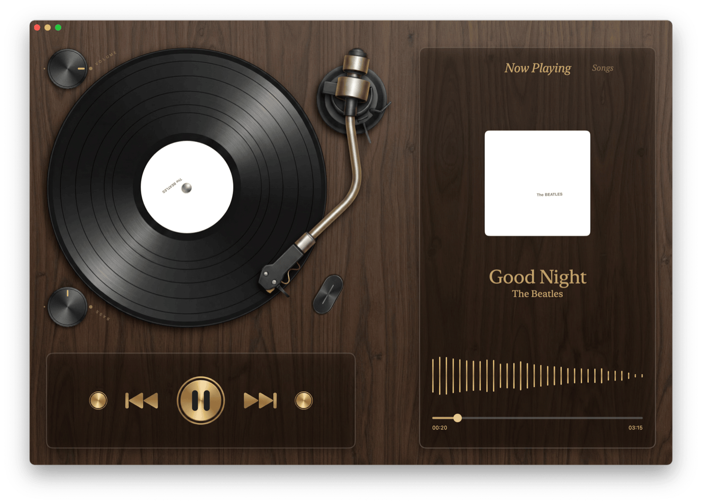

<h1 align="center">Vanilla Player</h1>

  English | <a href="./README_zh.md">简体中文</a>

An opinionated music player for macOS.

# Features

- Native, built natively for macOS
- Clean, record player-inspired UI
- Volume and Bass controls
- Real-time audio spectrum
- Audio source management

# Downloading

You can download the latest release from [GitHub Releases](https://github.com/baddagger/vanilla/releases).

The app will be blocked by Gatekeeper on first launch, you will need to open it from the `Security & Privacy` settings.

# License

This project is licensed under the MIT License.
