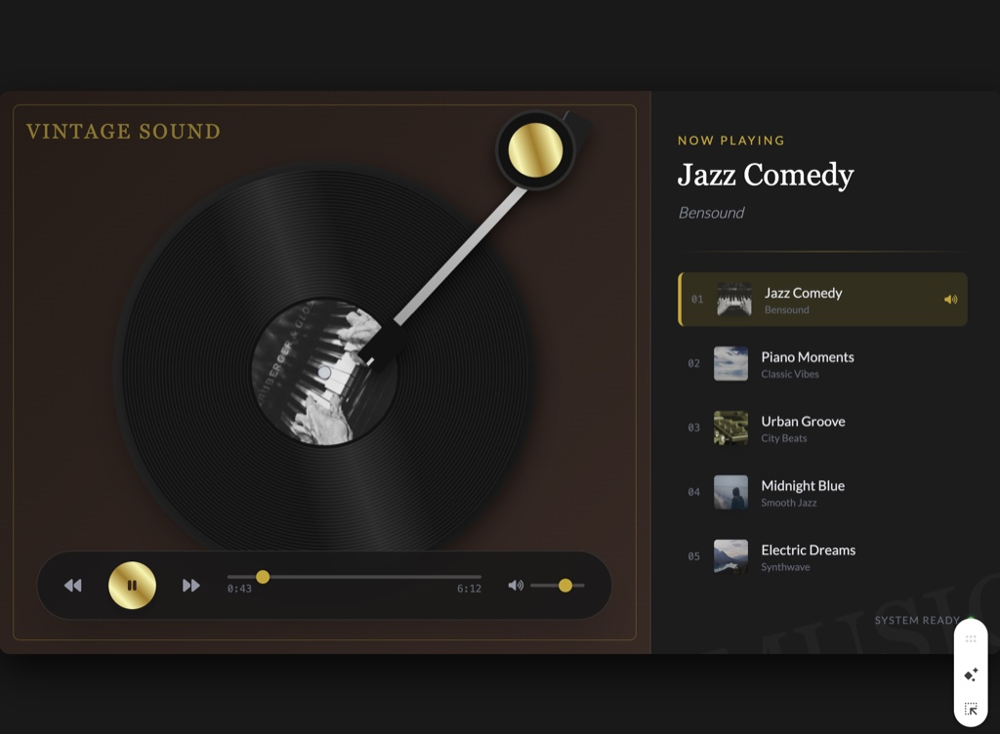
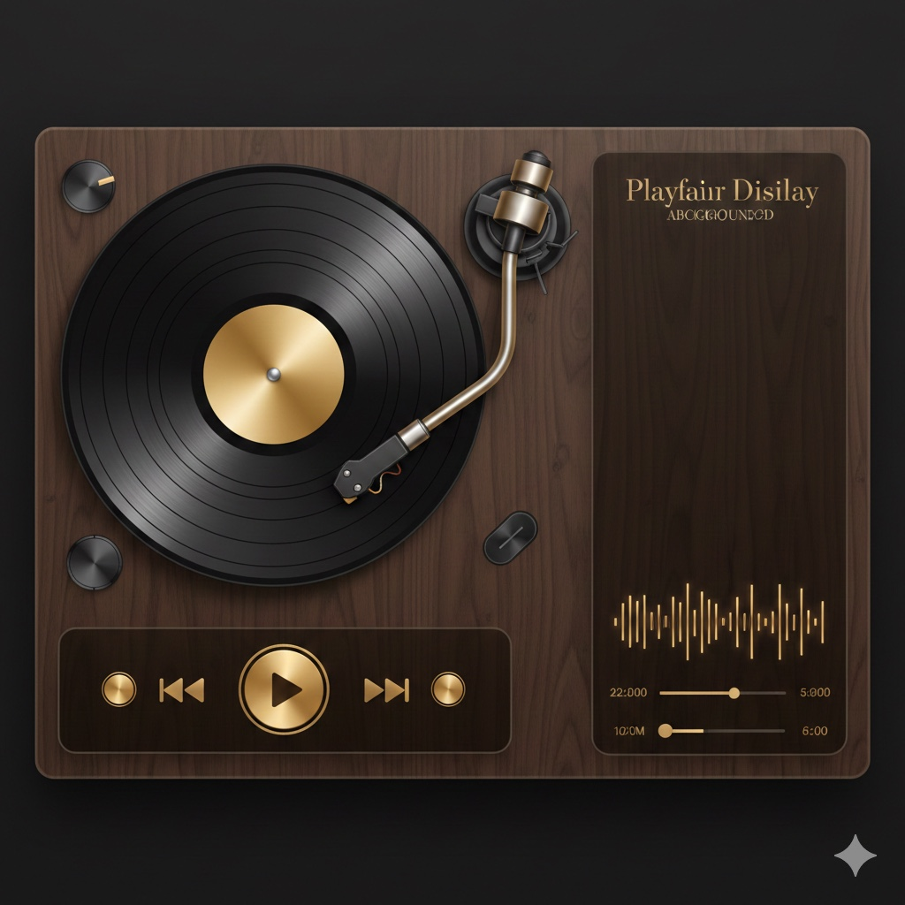
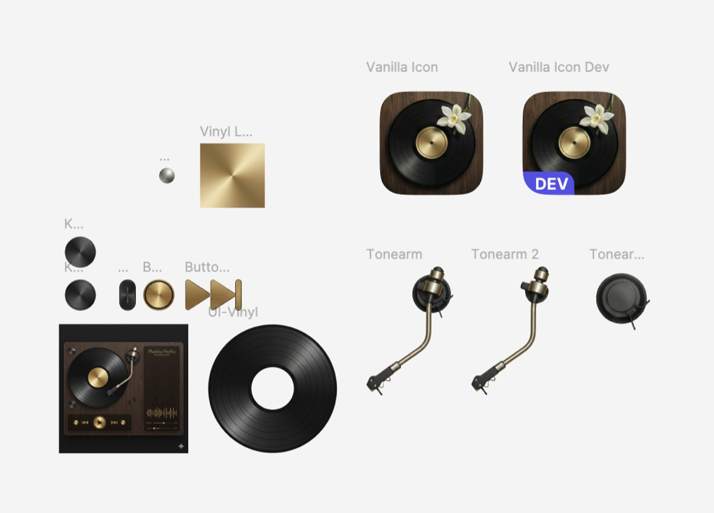

<h1 align="center">Vanilla Player</h1>

An opinionated music player for macOS.

# Features

- Native, built natively for macOS
- Clean, record player-inspired UI
- Volume and Bass controls
- Real-time audio spectrum
- Audio source management

# Downloading

You can download the latest release from [GitHub Releases](https://github.com/baddagger/vanilla/releases).

The app will be blocked by Gatekeeper on first launch, you will need to open it from the `Security & Privacy` settings.

# Story?

One day, I asked Gemini 3 Pro to generate a web player UI. It created a reasonable page:

Then I asked it to improve some details. After a few edits, it suddenly generated an image of the requested UI:

The design in the generated image felt much better than the previous HTML page, though there were some errors in the image. I decided to try building a real music player based on the design.

The web version of Gemini 3 Pro surely couldn't build a native app. I downloaded the new Google IDE and opened Xcode to start my first SwiftUI project. I didn't ask Gemini to create the UI from the design, it's impossible to create such UI layer by layer using only text-output models. I asked Nano Banana Pro to generate every component of the design, e.g., background, vinyl, tonearm, etc., then remove unwanted backgrounds using Figma and Photoshop. I combined them in SwiftUI and tweaked them carefully. This was the trickiest and the most time-consuming part of the project, I had to fight with the prompts and image backgrounds for hours and hours. I guess AI can't help much with these parts right now, but in the near future, AI will surely automate this process.

I asked Gemini (and Claude, when the limit exceeded) to implement basic functionalities and fix bugs and it did a good job, the app works well. I wrote less than 10 lines of code for the data layer (models, view models, managers, etc.).

# License

This project is licensed under the MIT License.
